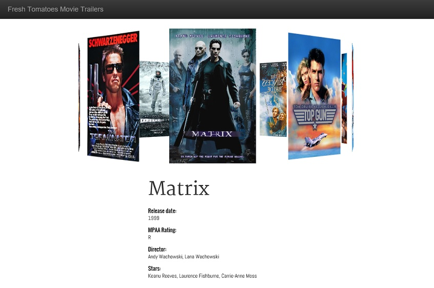

# 3D Movie Carousel
This project dynamically generates a web page detailing a specified collection of movies. It introduces a 3D carousel as a way of displaying the movie data, relying on 3D transformations supported in most HTML5 browsers (see Notes/caveats). It enables scrolling through the carousel by use of either the mouse scroll wheel, the left/right arrow, or the page up/down keys. This project also enables a data-driven way to specify the movie data via an input file, specified in json format.

The project extends Udacity's [Movie Trailer website project](https://www.udacity.com/course/viewer#!/c-ud036/l-997889780/e-991358862/m-1013629076).




## Getting Started
Once downloaded, you'll be running a Python script to generate the html file. You'll be free to modify the .json see a movies.json

### Prerequisities
- Python 3.5 installed and install path is included in environment PATH
- Modern browser that supports 3D transformations

### Running the script
1. Sync to local folder
2. Open command-line environment in that folder path
3. Open movies.json in your favorite editor. Feel free to edit/add/delete movie titles. The expected structure looks like the following:
```
{
  "movies": [
    {
      "title": "Top Gun",
      "description": "Adrenaline in the sky",
      "poster": "https://howtoexperience.files.wordpress.com/2012/10/topgun.png",
      "trailer": "https://youtu.be/iCrUqt9Uf3E",
      "imdb_rating":  "6.9",
      "release": "1986",
      "mpaa_rating": "PG",
      "director": "Tony Scott",
      "stars": "Tom Cruise, Kelly McGillis, Val Kilmer, Tom Skerritt"
    },
    ...
```
4. Run Python script with the movies.json file:
 * Usage: show_movies.py <path_to_json_file>
```
python show_movies.py movies.json
```

The script will echo the movie data to the console. It will then open the browser with the resulting html file.

## Notes/caveats
1. Regarding browser support, the html page was tested with the following browsers:
```
 Edge 25.10586.0.0
 IE 11 11.63.10586
 Chrome 47.0.2526
 Firefox 43.0.4
 Opera 34.0.2036.50
```
 * 3D transforms are not supported in Internet Explorer so don't use IE to view the page.
 * The mouse wheel scrolling functionality is not working in Firefox.

2. The file path for the dynamically-generated html file is based on the input json file path. Given that the html file needs to reference the css/js folders, the input file path will also need to reside in the same folder as the rest of the code.

3. The input json file will need to define a minimum of three movie titles in order for the carousel to render properly.

## Authors
* [Christopher Dac Le](https://github.com/cdacle)

## License
This project is licensed under the MIT License - see the [LICENSE.md](LICENSE.md) file for details

## Acknowledgments
* The 3D carousel display was adapted from David Desandro's [code sample](http://desandro.github.io/3dtransforms/docs/carousel.html)
